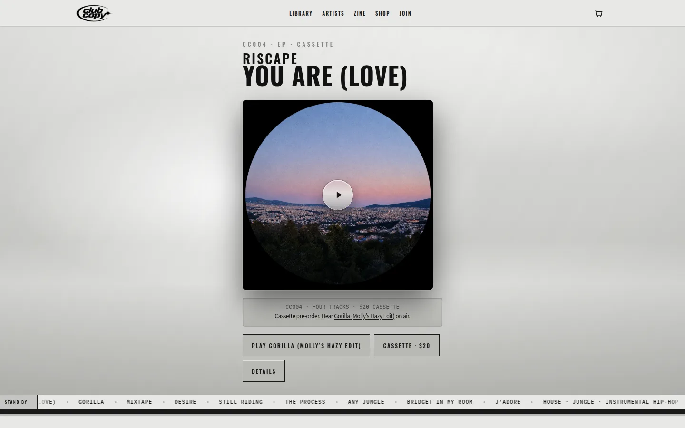
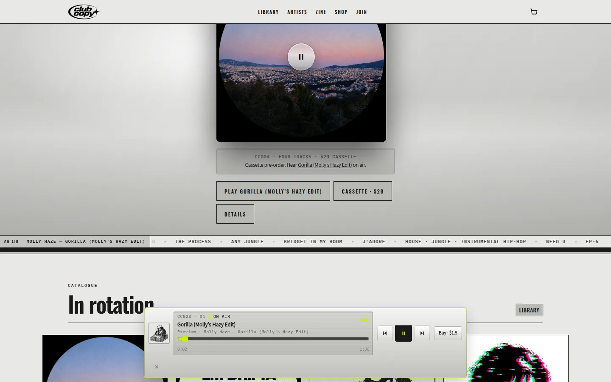
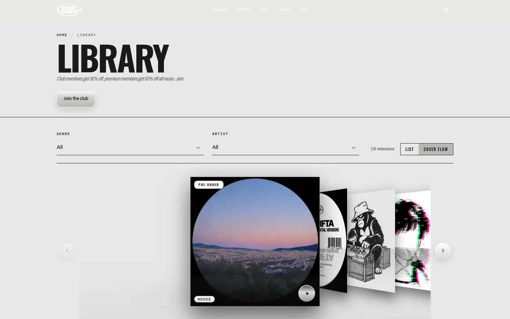
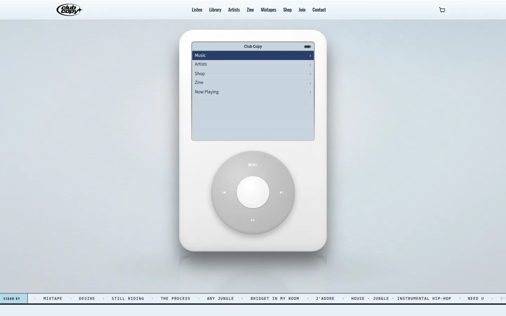
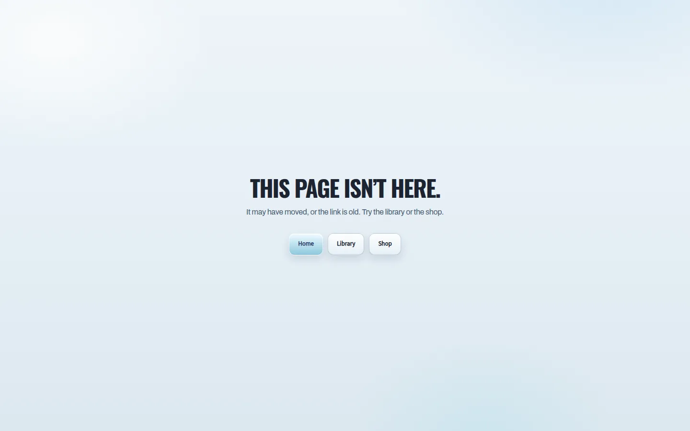

# Club Copy — Creative Audit, Pass B

**Role:** Senior Creative Director, Brand Designer, UX/UI Designer (music / editorial / culture)  
**Scope:** Repository `main` at `8765740` (listening plate, `/you-are-love`, nav cut, zine front, local-preview follow-up) **and** production `https://www.clubcopy.ca/` captured 18 September 2026. They are still not the same site. **No product code was changed for this audit.**  
**Date:** 18 September 2026  
**Previous:** [Pass A](creative-audit.md) scored HEAD **67 / 100** (replica iPod, Bondi live, unplayable feature). Pass A’s five changes shipped in #608 / #609. This pass re-scores the result.

---

## 1. Executive Summary

Pass A asked the site to stop wearing Apple hardware and start behaving like a small library you can hear. **On HEAD, that argument mostly landed.** The homepage is a steel listening plate for Riscape’s *You Are (Love)* — catalogue kicker, sleeve, LCD strip, honest cassette, five-link nav. Night Shift still has a voice. The dock is an aluminum spec bar, not a glass iOS pill. The replica Click Wheel is gone from the stage.

The remaining problem is no longer costume versus language. It is **split realities**.

1. **Public production is still the Pass A failure mode.** Live clubcopy.ca is a Bondi Click Wheel iPod featuring DESIRE, eight-item nav, ice field. `/you-are-love` **404s**. Until HEAD deploys, the identity upgrades exist only in git.
2. **HEAD still cannot play the record it is selling.** CC004 has titles only in `catalog.json`. The plate is honest (“Play Gorilla… on air”) — and then it **spins the Riscape sleeve while Molly Haze plays**. Music-first UX improved in copy, not in object.
3. **The replica moved, it did not leave.** Library desktop still **defaults to iTunes Cover Flow**. ~1,000 lines of Click Wheel CSS remain inlined in `index.html`. `/desire` is still a dark stereo. `/you-are-love` is steel underneath a white clipped title (`-webkit-text-fill-color: #fff` beating the OS lock). Empty Mixtapes and a night Instagram block still sit between culture and the Record Club.

The site now communicates, in the repo: *we are a steel library with a paper.*  
It still communicates, on the public web: *we are an iPod.*  
Inside HEAD it also communicates: *the object on the plate and the sound in the dock are not the same record.*

**Verdict:** Pass A’s five moves were the right ones. Score is up because the homepage is finally a record, not a device. It is held down by an undeployed live site, an un-cued feature, Cover Flow as the catalogue, and a design system that still fights itself.

---

## 2. Overall Score: **75 / 100**

A distinctive label OS in the repository. **+8** versus Pass A (67), almost entirely from retiring the Click Wheel hero, tightening nav, and compressing the home paper. Live production would still score **~62**.

---

## 2a. Live production vs repository (visual pass)

Captured 18 September 2026.

| | **Production (live)** | **Repository HEAD (`8765740`)** |
|---|---|---|
| Feature | DESIRE — Molly Haze, playable from the wheel | You Are (Love) — Riscape, cassette pre-order; Play starts **Gorilla** |
| Hero | Literal 4th-gen Click Wheel, ice LCD, navy invert | Steel **listening plate**, LCD grammar, no chassis |
| Field | Bondi cove | Steel `#E8E8E6` |
| Nav | Listen · Library · Artists · Zine · Mixtapes · Shop · Join · Contact | **Library · Artists · Zine · Shop · Join** |
| `/you-are-love` | **404** — “This page isn’t here.” Ice 404 | Canonical object page (steel lock, contrast bugs) |
| Library | Cover Flow default, ice page, cyan Join | Cover Flow **still default**, steel page |
| Mobile | Wheel + glass + cyan tab bar | Plate + steel tab bar (Library / Artists / Zine / Shop) |

**Keep from HEAD:** plate-as-object, five-link nav, aluminum dock, Night Shift masthead, sleeve index, Record Club desk, acid as LED.

**Keep from live (until HEAD ships):** native first-gesture audio of the *featured* record.

**Do not take from live:** Bondi, Click Wheel-as-logo, eight-item nav, cyan Join, Cover Flow as brand.

**Implementation implication:** The highest-leverage “creative” act right now is **shipping `main`**. Design work on an undeployed OS will keep losing to the replica the public already has.

---

## 3. Detailed Scorecard

Scores are **/10**. Weighted score = (score/10) × category weight. Pass A in parentheses.

### 3.1 Brand Identity & Originality — 7.5/10 · **15.0 / 20** *(was 6.5 / 13.0)*

**Evidence**

- Hero copy and structure now name a **Club Copy object** (`CC004 · EP · cassette`, Oswald lockup, sleeve) instead of “Club Copy” on an Apple LCD.
- Steel + LCD + acid-as-LED still the rare position. Most 1999–2005 revival sites went Bondi; this one did not, in git.
- Night Shift voice, catalogue numbers, cassette economics, Record Club — still original culture, not a template.
- Library Cover Flow, leftover Click Wheel CSS (`index.html` “4th-gen Click Wheel iPod — glossy white”), and live Bondi mean the brand is **two logos**: plate in the repo, iPod in the world.
- Playing Gorilla on the Riscape plate makes the feature feel like packaging for another artist’s single.

**Recommendations**

1. Deploy HEAD so the public logo is the plate, not the wheel.
2. The plate must **sound like the sleeve**, or the sleeve must **be the record that is on air**.
3. Treat Cover Flow as iTunes cosplay. List is Club Copy.

### 3.2 Music-First UX & Information Architecture — 6.5/10 · **9.8 / 15** *(was 5.5 / 8.3)*

**Evidence**

- Nav is the Pass A spec: Library · Artists · Zine · Shop · Join. Instagram and Mixtapes are out of chrome. Artists restored. This is a real IA win.
- Mobile tab bar matches four of five destinations (Join stays in header / drawer).
- Featured H1 links to `/you-are-love`, not `/news/please`. Canonical URL exists; zine is coverage.
- `you-are-love` tracks have **no** `preview` / `bandcampTrackId`. `js/plate.js` falls back to on-air (`gorilla`). Primary CTA is a long label: “Play Gorilla (Molly’s Hazy Edit).”
- In rotation still paints a **play bezel on CC004** (un-cued). Home still includes **Mixtapes · Coming soon** and **From the floor** Instagram before Record Club.
- Empty dock seed in `player.js` still defaults toward **desire**, not the plate feature.
- Footer still leads with Copy House Publishing, not Club Copy.

**Recommendations**

1. Wire one cue for CC004 (even 30s) **or** put the playable release on the plate and badge the pre-order beside it — not as a different sleeve spinning.
2. Hide Mixtapes and IG modules until they have inventory. Join follows Night Shift.
3. Unplayable sleeves: no play glyph. Pre-order stamp only.
4. Footer: Club Copy wordmark first.

### 3.3 Visual Language (Colour, Typography, Layout) — 7.0/10 · **10.5 / 15** *(was 7.0 / 10.5)*

**Evidence**

- Home Google Fonts request is now Oswald / Archivo / IBM Plex Mono. That Pass A purge **did** land on `index.html` and `you-are-love.html`.
- Steel field on home, library, zine, artists is coherent.
- `/you-are-love` sets `body.release-object` and `club-copy-os.css` inks the page `#1A1A1A`, but `.ra-hero-title` still uses `-webkit-text-fill-color: #fff` from `release-archive.css` — **white title on steel**. Cart icon is a black square (`nav-cart` given black fill in the same lock).
- `/desire` remains a **dark continuum** (Space Grotesk in the archive CSS header, VFD/stereo metaphor).
- Home still loads a night Instagram band and a gold-rule mixtapes band — three papers after one steel hero.
- Night Shift masthead (inverted SHIFT, XXII, barcode) is still the strongest graphic on the site.

**Recommendations**

1. Object pages: ink titles, not clipped white. Override `-webkit-text-fill-color` in the OS lock, or stop loading archive title recipes on steel pages.
2. One paper colour through home: no sudden `#111` Instagram well unless it is a labeled app.
3. Desire-class pages: same steel object as `/you-are-love`, with **Play** that actually plays.

### 3.4 Interface & Interaction Design — 7.0/10 · **10.5 / 15** *(was 6.0 / 9.0)*

**Evidence**

- Plate actions are real buttons: Play / Cassette / Details. No MENU/Select geometry. That was the Pass A P0.
- Aluminum dock appears on play: catalogue, on-air, scrub, buy. Right typology.
- Dock **Buy $1.50** is Gorilla while the plate still offers **Cassette · $20** for a different SKU — two checkouts in one glance.
- Mobile: Play label wraps; Cassette / Details clip under the ticker. Tab bar is clear.
- Cover Flow is the first library interaction ≥720px (`js/library.js` sets `viewMode = 'covers'`). Markup hides the toggle; JS reveals Cover Flow anyway.
- Invert-select, LCD rows, “Added” on cassette add — keep these.

**Recommendations**

1. One Continuity Deck: plate LCD and bottom dock are the same component state.
2. Buy in the dock must match the sounding object.
3. Library default = list. Cover Flow opt-in or delete.
4. Mobile plate: two buttons (Play · Cassette), Details as text link; shorten Play to “Play on air” if the feature is uncued.

### 3.5 Catalogue & Music Player Experience — 7.0/10 · **7.0 / 10** *(was 6.5 / 6.5)*

**Evidence**

- `catalog.json` still the spine: 19 releases, SKUs, member prices, Bandcamp IDs.
- Localhost now prefers `/previews/*.mp3` and ignores stale Bandcamp errors (#609). Production path remains `/api/bandcamp-stream`.
- Sleeve wall hydrates from JSON; metadata on cards is collectible (`CC004 · EP`).
- Featured EP cannot play. Cover Flow is still the library brand. Static `library.html` featured row is still DESIRE.
- Planet MP3 remains a parallel dark app.

**Recommendations**

1. Cue the feature. Then the player story is one record.
2. List default; Regular / Club tiles stay — that is the collectible UI, not Cover Flow.
3. Hydrate library static featured from current catalogue (CC004), not a leftover DESIRE shelf.

### 3.6 Zine & Editorial Integration — 8.0/10 · **8.0 / 10** *(was 8.0 / 8.0)*

**Evidence**

- Full paper at `/news` is excellent: desks, LIVE slug, cover story *Riscape: Heads Down*, Stars, Tonight’s Record.
- Home `.zine--home` hides folio/cols and lead copy; keeps nameplate, just-in ticker, polaroid lead, three posts, tonight’s record. Compression **happened**, but the lead is still a **full magazine spread** — it visually rivals the plate.
- Home lead is on-roster (Riscape). Tonight’s Record can still be Portishead inside the paper — correct for a zine, noisy if it sits on the same scroll as CC004 without a “in the paper” vs “on Club Copy” distinction.

**Recommendations**

1. Home: masthead + one image + three headlines + link to the paper. The current lead is still “the issue,” not “the front.”
2. Do not flatten voice.

### 3.7 Motion & Micro-interactions — 6.5/10 · **3.3 / 5** *(was 6.5 / 3.3)*

**Evidence**

- Acid LED, dock rise, ticker, `prefers-reduced-motion` still exist.
- Vinyl spin + pause glyph on the **featured** sleeve while **another** catalogue ID is playing is the worst motion on the site: it lies.
- Cover Flow drag/snap is replica motion.
- Sleeve hover lift on the wall is tactile and fine.

**Recommendations**

1. Spin / `is-live` only on the object that is sounding.
2. Motion = state (LED, invert, progress). No Cover Flow as default theatre.

### 3.8 Mobile & Responsive Experience — 7.5/10 · **3.8 / 5** *(was 5.5 / 2.8)*

**Evidence**

- First screen is lockup + sleeve + LCD + actions + ticker + tab bar. No wheel. This is the Pass A mobile P0, done.
- Tab bar: Library / Artists / Zine / Shop — steel, not cyan.
- Actions collide with the ticker; long Gorilla label.
- Safe-area and dock offset include `--tabbar-h`.

**Recommendations**

1. Stack plate actions above the ticker with gap; never let the station ID eat buttons.
2. Sticky dock after first play (already intended; keep it above the tab bar).

### 3.9 Consistency & Design System — 5.0/10 · **2.5 / 5** *(was 4.0 / 2.0)*

**Evidence**

- Nav block is now repeated consistently (home, you-are-love, desire, library).
- Homepage still: `site.css` → listen-object → listen-plate → fx → player → news → mixtapes → **~1,500 lines of unused iPod CSS** → home-zine → aqua-world → home-folio → club-copy-os.
- Cache tags `st18` / `st19`. `--bondi` alias. `aqua-world.css` header still describes a Click Wheel.
- Dual release dialects. Artists nav bar paints a grey strip unlike home.
- Naming: VCRPlayer, Night Shift, Record Club, Planet MP3, Copy House.

**Recommendations**

1. Delete dead iPod CSS and `js/ipod.js` from the home path once confirmed unused.
2. One override file. Fill-color and cart icon bugs prove locks lose to leftover recipes.
3. One object-page template.

### 3.10 Technical Feasibility / Incremental Implementation — 8.5/10 · **4.3 / 5** *(was 8.5 / 4.3)*

**Evidence**

- Still static HTML/CSS/JS + Vercel APIs. Catalogue-driven wall and player. No new deps required.
- #608/#609 proved five identity moves can ship as HTML/CSS/JS. The leftover work is the same shape.
- Risk: live CDN/cache still serving Bondi; dual locks; Cover Flow JS default independent of hidden markup.

**Recommendations**

1. Sequence: **deploy HEAD → cue or re-feature → Cover Flow off → object-page ink → delete iPod corpse / empty modules.**
2. No framework rewrite.

---

### Score table

| Category | /10 | Weight | Weighted | Pass A |
|---|---:|---:|---:|---:|
| Brand Identity & Originality | 7.5 | 20 | 15.0 | 13.0 |
| Music-First UX & IA | 6.5 | 15 | 9.8 | 8.3 |
| Visual Language | 7.0 | 15 | 10.5 | 10.5 |
| Interface & Interaction | 7.0 | 15 | 10.5 | 9.0 |
| Catalogue & Music Player | 7.0 | 10 | 7.0 | 6.5 |
| Zine & Editorial Integration | 8.0 | 10 | 8.0 | 8.0 |
| Motion & Micro-interactions | 6.5 | 5 | 3.3 | 3.3 |
| Mobile & Responsive | 7.5 | 5 | 3.8 | 2.8 |
| Consistency & Design System | 5.0 | 5 | 2.5 | 2.0 |
| Technical Feasibility | 8.5 | 5 | 4.3 | 4.3 |
| **Total** |  | **100** | **74.7 → 75** | **67** |

---

## 4. Top 5 Strengths

1. **The homepage is a record.** Catalogue kicker, sleeve, LCD, cassette price. This is reinterpretation: iPod *grammar* without iPod *chassis*.
2. **Nav finally matches a label.** Library · Artists · Zine · Shop · Join. The site can be learned.
3. **Night Shift is still the culture engine.** Masthead, desks, Riscape cover, Vancouver slug. Do not “clean” it.
4. **Listening is built.** Shared player, Bandcamp bridge, local preview fallback, on-air chips, aluminum dock.
5. **Collectible economics.** CC numbers, cassette SKU, Regular/Club tiles, Record Club desk — membership as practice.

**Preserve:** steel tokens, Oswald/Archivo/Lucida/Plex, plate typology, dock-as-spec-bar, Night Shift writing, catalogue schema, acid LED, sleeve metadata, Record Club copy.

---

## 5. Top 5 Creative Gaps

1. **Live is still the replica.** Bondi iPod, DESIRE, `/you-are-love` 404. HEAD’s identity is invisible to listeners.
2. **The feature does not play.** Honest copy does not fix a plate that advertises CC004 and sounds CC023, then spins the wrong vinyl.
3. **Cover Flow is the catalogue.** The replica the brief forbade now lives on `/library`.
4. **Two release operating systems.** Steel object (broken type) vs dark stereo Desire vs leftover iPod CSS.
5. **Home still dumps empty product.** Mixtapes Coming soon + Instagram night well between paper and club.

---

## 6. P0 (Essential) Improvements

Do these before any new decoration.

1. **Ship `main` to clubcopy.ca.** Until then Pass A’s live problems are the brand. Confirm `/you-are-love` is not 404.
2. **One sounding object on the plate.** Wire a CC004 cue **or** feature Gorilla (or the latest playable) as the plate artwork. Never spin sleeve A while playing release B.
3. **Library default = list.** Cover Flow off unless `?view=covers`. Hide or delete the Cover Flow control.
4. **Steel object page that actually inks.** `-webkit-text-fill-color` and cart fill on `/you-are-love`; then use that template on Desire-class pages (Play + Buy + specs, no dark deck as identity).
5. **Remove play bezels from un-cued sleeves.**

---

## 7. P1 (Important) Improvements

1. Home Night Shift: masthead + one image + three headlines — smaller than the current cover spread.
2. Hide `#mixtapes` and `#instagram` until `mixtapes.json` / feed earn a slot. Record Club directly after the paper.
3. Delete unused Click Wheel CSS and `js/ipod.js` from the home document.
4. Dock Buy = sounding SKU; plate Cassette = CC004 only.
5. Type purge on remaining templates (Desire still loads extra families).
6. Footer: Club Copy first.
7. Mobile plate: two chrome buttons, no ticker overlap.
8. Library static featured row = current feature, not DESIRE.

---

## 8. P2 (Polish) Improvements

1. Merge aqua-world + OS + folio into `site.css` + one surface file.
2. Rename `vcr-player` → `cc-deck` when those files are open.
3. Keep LCD “Added” toast.
4. Planet MP3 as a named app on steel, or keep it clearly separate.
5. Optional desktop Cover Flow / wheel only as easter egg.
6. OG always the sleeve (already true on HEAD home).
7. Artists page nav: same steel bar as home, not a grey slab.
8. Cache tag one version (`st20`) after corpse deletion.

---

## 9. Ideal Homepage Structure

Unchanged in intent from Pass A; HEAD is ~70% there.

1. **Steel mast** — wordmark, five links, cart.  
2. **Now** — featured plate that **plays the sleeve** (or shows the sleeve of what’s playing).  
3. **In rotation** — 8–12 sleeves, play only if cued.  
4. **Night Shift front** — slug + one image + three headlines.  
5. **Record Club** — three levels.  
6. **Footer** — Club Copy, then publisher, Planet MP3 as app.

No Instagram grid. No empty mixtapes. No Cover Flow. No 100vh gadget.

---

## 10. Ideal Music Player Direction

Unchanged, now closer:

**Not:** iOS pill, Spotify embed, Click Wheel, Cover Flow stage, VHS deck.

**Yes:** aluminum spec bar — plate LCD and bottom dock as **one state**.

- Data: artist, title, `CCxxx`, index, time, format of *this* object.  
- Controls: prev / play-pause / next / scrub / buy-that-format.  
- State: grey idle, acid LED playing; `is-live` only on the sounding sleeve.  
- Sound: keep Bandcamp/preview pipeline; no visualizer gimmicks.

---

## 11. Design System (target — incremental)

Same stack as Pass A. Only new rule from Pass B:

**Object pages must set `-webkit-text-fill-color` with `color`.** Colour alone loses to `release-archive.css`.

### Typography

| Role | Face | Use |
|---|---|---|
| Display | Oswald 600/700 | Titles, lockups, nav |
| Body | Archivo 400/600 | Zine, notes |
| UI / LCD | Lucida Grande stack | Menus, player, alerts |
| Spec | IBM Plex Mono | Catalogue, times, prices |

### Colour

Steel `#E8E8E6` · Pearl `#F4F4F2` · Ink `#1A1A1A` · Select `#2A2A28` · Acid `#C6F000` on `#141414` for playing only. No Bondi fill.

### Components

Keep: nav, sleeve, LCD list, aluminum deck, price tiles, zine masthead, join radios, chrome buttons.  
Deprecate: Click Wheel body, Cover Flow as default, cassette hi-fi as page identity, phosphor on daylight.

---

## 12. 90-Day Incremental Roadmap

Pass A is done in git. Do not restart it.

### Pass B — One record, one world *(this scorecard)*

- Deploy HEAD.  
- Cue or re-feature so plate = sound = spin.  
- Library list default.  
- Ink the object page; apply to playable releases.  
- Hide empty mixtapes/IG.  

### Pass C — OS hygiene

- Delete iPod inline CSS / unused `ipod.js`.  
- Merge Aqua/OS/folio.  
- Font purge on archive templates.  
- Planet MP3 labeled.  
- Rename player internals if touched.

**Out of scope:** framework rewrite, new replica objects, returning to Bondi to “match live.”

---

## What not to do

- Do not wait on more Y2K chrome while live is still an iPod.  
- Do not flatten Night Shift.  
- Do not luxury-black the whole site because Desire is dark.  
- Do not make Cover Flow “better.” Turn it off.  
- Do not add a 30s silent gap and call CC004 playable. Wire a file or change the object.

---

## Pass A five-change review

| # | Pass A recommendation | HEAD status |
|---|---|---|
| 1 | Listening plate; Play (or honest pre-order + play next) | **Done** — plate + honest Gorilla CTA; **spin/sound mismatch remains** |
| 2 | Canonical `/you-are-love` + on-site cue | **URL done; cue not done.** Live 404. |
| 3 | Nav: Library · Artists · Zine · Shop · Join | **Done** |
| 4 | Home Night Shift as front page | **Partial** — modules hidden; lead still a full spread |
| 5 | Aluminum dock + steel tokens on every template | **Dock yes; Desire still a second brand; object title fill still white** |

---

If I could only implement five changes, they would be:

1. **Deploy current `main`** so clubcopy.ca is the steel plate, not the Bondi Click Wheel, and `/you-are-love` exists.  
2. **Make the plate play the sleeve** — wire a CC004 cue or put the on-air release’s artwork on the plate; never spin Riscape while Gorilla sounds.  
3. **Default Library to the metadata list** and take Cover Flow out of the first impression.  
4. **Finish the steel object page** (real ink, working cart icon, Play when a cue exists) and use it for Desire-class releases instead of the dark stereo.  
5. **Cut empty home modules and dead iPod CSS** so Record Club follows Night Shift on one paper, and the homepage document is a plate, not a museum of the replica.
