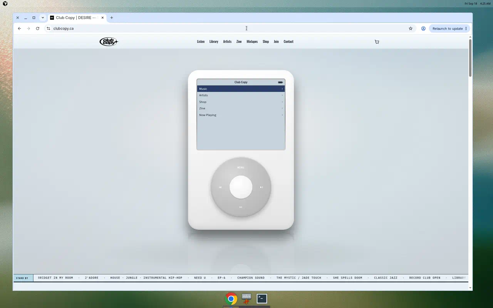
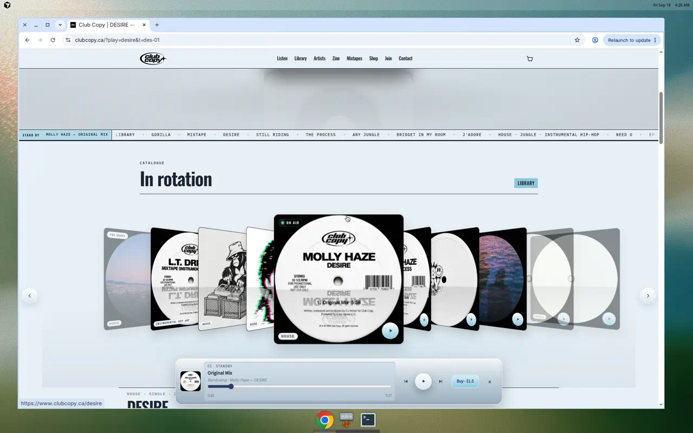
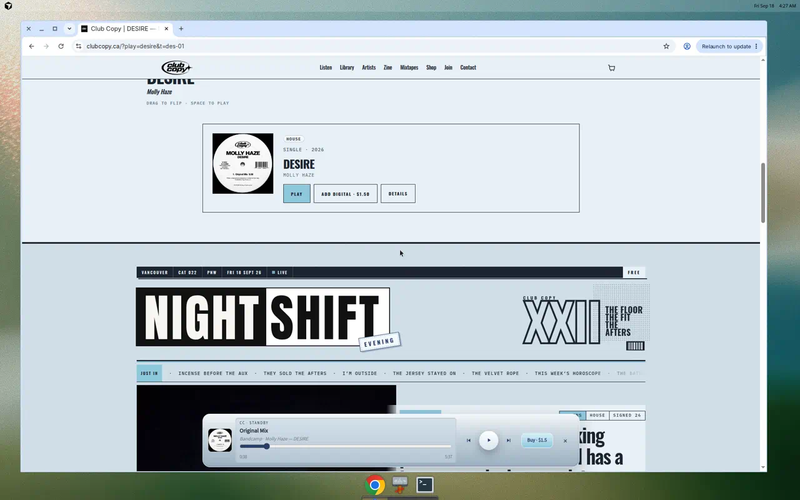
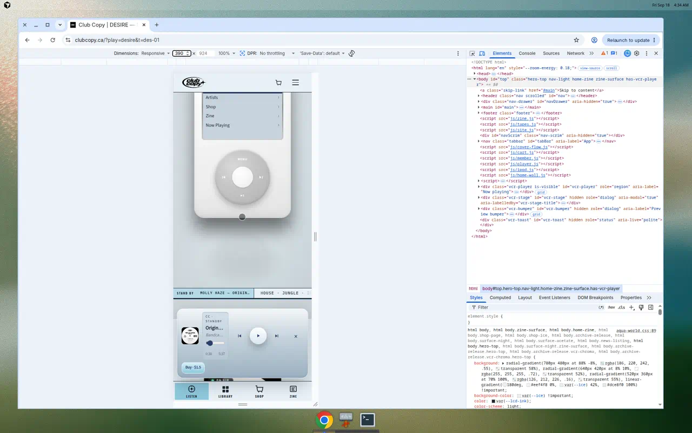
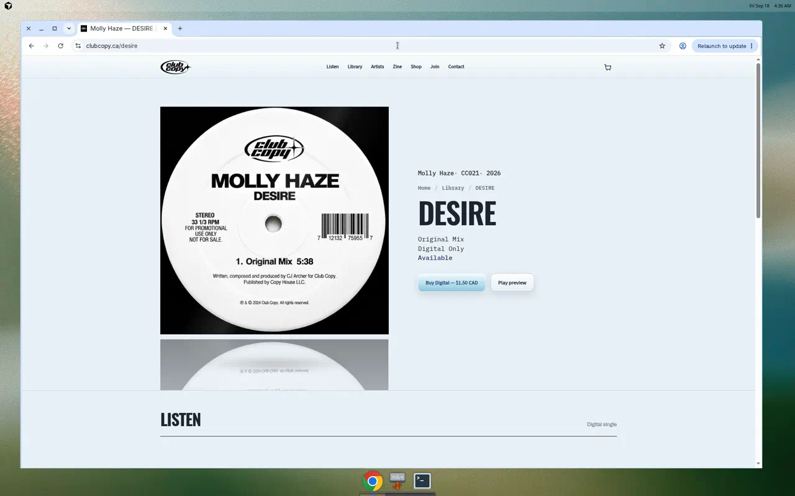

# Club Copy — Creative Audit (Pass A)

**Superseded for current HEAD by [Pass B](creative-audit-pass-b.md)** (post #608 / #609). Pass A scored **67 / 100** before the listening plate shipped.

**Role:** Senior Creative Director, Brand Designer, UX/UI Designer (music / editorial / culture)  
**Scope:** Repository HEAD at `st18` (steel lock, You Are (Love) hero) **and** production `https://www.clubcopy.ca/` as captured 18 September 2026. They are not the same site. No product code was changed for this audit.  
**Date:** 18 September 2026  
**Constraint:** Preserve distinctive work. Recommend the smallest set of high-impact moves. Reinterpret 1999–2005 digital culture; do not recreate it.

---

## 1. Executive Summary

Club Copy already has a **real identity**, not a moodboard. The site is not a generic independent-label template. In the repo it is becoming a **brushed-steel listening OS**; in production it is still a **Bondi Click Wheel replica** with catalogue numbers, cassette economics, a Pacific Northwest evening paper, and a membership desk. That combination is rare and worth protecting — once the replica and the ice-blue fill are treated as a phase, not the brand.

The problem is not lack of taste. The problem is **costume versus language**.

The brief asks for a future-facing label inspired by early digital music culture (iPod-era interfaces, MP3 players, CD-ROM software, digital cameras, underground club graphics) that stays **minimal, tactile, music-first, metadata-rich, collectible, and unmistakably digital** — using modern web technology to **reinterpret**, not recreate.

What the site does well:

- Steel, LCD ink, Lucida Grande chrome, Oswald lockups, IBM Plex Mono specs.
- Catalogue objects (CC004, formats, member prices, SKUs).
- Night Shift as a genuine editorial voice (the floor / the fit / the afters).
- A working on-site player (`js/player.js`) wired to Bandcamp streams and `data/catalog.json`.

Where it slips into nostalgia and gimmick:

- The homepage hero is a **literal 4th-gen Click Wheel iPod** (white polycarbonate, battery icon, MENU/Select hub, classic list UI). Comments in CSS even specify “not nano/soap-bar.” That is product replica, not reinterpretation.
- Library still offers **iTunes Cover Flow**.
- Release pages still speak a **dark stereo / cassette-deck dialect** (`css/release-archive.css`) while home insists on light aluminum. Two brands share one URL.
- Design-system archaeology: `aqua-world.css` (now grey), `club-copy-os.css` as a “lock,” huge homepage inline CSS, leftover fonts (Anton, Newsreader, Source Serif 4, Space Grotesk, Share Tech Mono).
- Music-first promise is broken on first contact: featured release **You Are (Love)** has **no preview tracks** in `catalog.json`; the iPod Play key is a **cassette pre-order**. Listen is a hash link. Artists are hidden from home and missing from home nav. Instagram and empty Mixtapes sit in primary navigation.

The site currently communicates: *we are people who love early-2000s Apple hardware and Vancouver nights.*  
It should communicate: *we are a small library you can hear, keep, and subscribe to — using the grammar of that era, not its props.*

**Verdict:** Strong raw material. Score is held down by replica UI, split surfaces, and a homepage that stages a device instead of a record. Incremental CSS/HTML/JS work can close most of the gap without a rebuild.

---

## 2. Overall Score: **67 / 100**

A distinctive culture site. Repo HEAD has a coherent steel thesis, undermined by literal iPod cosplay, competing page dialects, and a hero that cannot play the record it is selling. **Live production** can play music immediately, but it is more costume (Bondi LCD, Cover Flow, cyan CTAs) than the brief allows.

---

## 2a. Live production vs repository (visual pass)

A browser pass of [clubcopy.ca](https://www.clubcopy.ca/) on 18 September 2026 shows **an older Aqua/Bondi build**, not the `st18` steel lock in this repo. Score **67** is for **HEAD**. Live would score **~62**: music-first **up**, originality and visual language **down**.

Do not treat a generous “the iPod is a clever content system” reading as the creative brief. The stills show a **product replica**. Functional replica is still replica.

| | **Production (live)** | **Repository HEAD** |
|---|---|---|
| Feature | DESIRE — Molly Haze, **plays** from the wheel | You Are (Love) — Riscape, **pre-order**, no cue |
| LCD | Ice-blue menu, **navy invert-select** (classic iPod) | Grey LCD, graphite select (`club-copy-os.css`) |
| Field | Cool Bondi cove, cyan “Library / Join / Play” | Steel `#E8E8E6`, acid LED only |
| In rotation | **iTunes Cover Flow** + On air | Sleeve-card grid from `catalog.json` |
| Nav | Listen · Library · **Artists** · Zine · Mixtapes · Shop · Join · Contact | Artists **hidden**; Instagram in the HTML |
| Mobile | Click Wheel + **tab bar** (Listen / Library / Shop / Zine) + glass dock | Same wheel; dock-away rules; no tab bar in the home markup reviewed |
| Release `/desire` | Clean sleeve + meta + Buy / Play — **this is the right object page** | `release-archive.css` still documents a dark stereo/cassette dialect |

**What live gets right (keep):** native preview without a gate; ticker as station ID; Night Shift masthead; `/desire` as a collectible spec sheet; Record Club tiers.

**What live gets wrong vs the brief:** Bondi ice as atmosphere; cyan as the interactive colour; Cover Flow as the catalogue; the iPod as the logo of the label; “Tonight’s Record” competing with Club Copy (Addison Rae / Columbia on the home strip while the label’s own record is in the gadget).

**Implementation implication:** Do not “improve” production by adding more Apple chrome. Ship steel tokens, kill Cover Flow on home, keep **play-on-first-gesture** from live, and use the **DESIRE object page** as the release template — not the replica player as the homepage.

---

## 3. Detailed Scorecard

Scores are **/10**. Weighted score = (score/10) × category weight.

### 3.1 Brand Identity & Originality — 6.5/10 · **13.0 / 20**

**Evidence**

- README and `css/site.css` lock a clear world: “brushed iPod steel, not Bondi ice.” Tokens: steel `#E8E8E6`, LCD ink `#1A1A1A`, stamp `#B8B8B4`, select `#2A2A28`, LED/acid `#C6F000`.
- `css/club-copy-os.css` exists because the brand previously drifted into Aqua/cyan. The lock is a sign of conviction *and* of unfinished unification.
- Night Shift copy is original culture writing, not press-release English.
- Slogan in schema: “Music we want to keep.” That is the brand in six words. It is quieter than the Click Wheel.
- Hero implementation (`index.html` ~387–765, `js/ipod.js`) reconstructs a 4th-gen iPod OS: status bar, chevron list, wheel ticks, “Added to Cart” LCD alert. That is derivative of Apple’s object, however lovingly built.
- `css/cover-flow.css` is titled “iTunes Cover Flow + jewel-case sleeves.”

**Recommendations**

1. Keep **steel + LCD + catalogue + zine voice**. Retire **Apple hardware as the logo of the site**.
2. Treat the iPod as **source grammar** (list, invert-select, click, LCD type) applied to Club Copy objects — not as a 1:1 device on a pedestal.
3. Make the collectible object the **release** (sleeve, catalogue line, format), not the player chassis.

### 3.2 Music-First UX & Information Architecture — 5.5/10 · **8.3 / 15**

**Evidence**

- Home primary nav: Listen, Library, Zine, Mixtapes, Instagram, Shop, Join, Contact (8 items). **Artists** and **About** are absent on home; Artists exists on other pages and is **CSS-hidden** on home (`club-copy-os.css`).
- Listen is `#listen` (catalogue wall), not immediate playback of the feature.
- Featured H1 links to `/news/please` (zine article), matching `catalog.json` `"page": "/news/please"` — a catalogue object living at an editorial URL.
- You Are (Love) tracks have titles only; **no** `preview` / `bandcampTrackId`. `js/ipod.js` `FEATURED.playable` starts `false`; Play shows “Cassette pre-order.”
- In rotation hydrates from full `catalog.json` (`js/home-wall.js`) — good — but the hero does not.
- `data/mixtapes.json` is `"tapes": []`; home still has a Mixtapes nav item and a “Coming soon” section.
- Instagram is a primary destination equal to Library.
- Footer leads with Copy House Publishing, not Club Copy wordmark + catalogue.

**Recommendations**

1. Collapse nav to **Library · Artists · Zine · Shop · Join** (+ cart). Drop Instagram and empty Mixtapes from chrome.
2. Featured record always has **one audible cue** (even 30s). If embargoed, hero should feature the **latest playable** release and stamp the pre-order beside it.
3. Give music objects **canonical URLs** (`/you-are-love` or `/library/you-are-love`); zine can cover them, not own them.
4. Put roster back in the system (nav + a compact home strip), not as a full homepage section and not as `display: none`.

### 3.3 Visual Language (Colour, Typography, Layout) — 7.0/10 · **10.5 / 15**

**Evidence**

- Steel field is disciplined and contemporary; acid lime as **playing LED** (not fill) is the right kind of digital accent.
- Type roles are well chosen when followed: Oswald display, Archivo body, Lucida Grande UI/LCD, IBM Plex Mono specs.
- Homepage still loads Anton, Archivo Black, Barlow Condensed, Newsreader, Source Serif 4, Space Grotesk in one Google Fonts request (`index.html`).
- Inner pages still request Space Grotesk / Share Tech Mono while OS lock maps display to Oswald.
- Release archive CSS header still documents “dark continuum” and Space Grotesk; `club-copy-os.css` greys some tokens but does not rewrite the stereo metaphor.
- Night Shift masthead (inverted slug, barcode, xerox energy) is strong; on the same steel ground as the iPod it reads as **two movies** rather than one OS with a magazine app.

**Recommendations**

1. One font stack sitewide: **Oswald / Archivo / IBM Plex Mono / system Lucida stack**. Kill unused families.
2. Keep acid lime for **state** (on air, playing, member). Never as 2000s rave fill.
3. Let Night Shift keep tabloid structure, but **one paper colour and one ink** — already mostly true; do not reintroduce cyan/magenta “zine” accents.
4. Release pages: same steel field as home; dark only as a **listening well** around artwork, not a second brand.

### 3.4 Interface & Interaction Design — 6.0/10 · **9.0 / 15**

**Evidence**

- Click wheel (`data-ipod-wheel`) is a full pointing-device OS: angle accumulation, MENU, Select hub, keyboard. Impressive engineering; poor fit as the **only** way to use the hero on a phone.
- Sleeve cards use a simple play bezel (`css/listen-object.css`) — this is the better pattern: object + chrome, not a replica gadget.
- Dual playback chrome: hero iPod **and** floating `.vcr-player` dock (`css/player.css`). Dock is hidden while hero is in view (`vcr-dock-away`). Two mental models.
- Join desk uses radio-levels and a “card” panel — membership as object. Good.
- Skip link, focus-visible rings, `prefers-reduced-motion` exist in `site.css` / `fx.css` / `home-zine.css`.
- Status chips (Stand by / On air) are broadcast language that fits a label-as-station without copying Apple.

**Recommendations**

1. One **Continuity Deck** for audio everywhere. Hero becomes a **now-playing plate**, not a second OS.
2. Keep invert-to-select lists and clicky confirmation as **micro-language**, not a wheel that must be dragged.
3. Primary actions: Play · Add format · Open notes. Secondary: wheel easter egg on desktop only, if kept at all.

### 3.5 Catalogue & Music Player Experience — 6.5/10 · **6.5 / 10**

**Evidence**

- `data/catalog.json` is the spine: catalogue IDs, genres, formats, SKUs, Bandcamp IDs, durations.
- Library: genre/artist filters, Regular vs Club price tiles, list vs Cover Flow. Metadata-rich and collectible.
- Player: Bandcamp `mp3-128` via `/api/bandcamp-stream`; local previews fallback; no Web Audio on those streams (CORS) — documented honestly in README.
- Cover Flow and library Cover Flow hint (“Drag to flip · Space to play”) recreate iTunes.
- Featured EP cannot play. Several library rows lack play buttons in static HTML (inconsistent hydration).
- Planet MP3 (`planet.html`) is a dark, time-of-day stream — a parallel product with leftover cool-blue radials in page CSS.

**Recommendations**

1. Player as **aluminum LCD strip**: track, catalogue, time, format, buy. Spec sheet, not pill, not iOS mini-player (README already wants this).
2. Every sleeve in rotation and every library row: play if a cue exists; otherwise a clear **Pre-order / Hear on street date** state.
3. Keep list as default library view. Cover Flow is P2 at most, or remove — it is the gimmick the brief warns about.
4. Queue = catalogue, not a hidden VCR metaphor. Rename remaining `vcr-*` internals when touching files.

### 3.6 Zine & Editorial Integration — 8.0/10 · **8.0 / 10**

**Evidence**

- Night Shift is the most *Club Copy* thing on the site: desks, live slug, polaroid lead, Stars for the Floor, Tonight’s Record, gossip/ritual/fit.
- Home embeds a near-full paper (`section.news.zine.zine--home`) after three sleeves — editorial can out-shout the catalogue.
- Zine CSS (`css/news.css`) is a full typesetting system (grain, fiber, gothic masthead). Intentionally 1997–99 magazine on steel.
- Featured music and featured story can diverge (Riscape EP vs Dummy / Portishead as tonight’s record) — culture-first, but the label’s own record must still win the first screen.

**Recommendations**

1. Home zine: **masthead + one cover + three headlines + tonight’s record**. Full paper lives at `/news`.
2. Bind a zine kicker to the **featured catalogue object** when a release is out (“in the paper” → that record).
3. Preserve voice. Do not “clean up” the writing into brand-safe captions.

### 3.7 Motion & Micro-interactions — 6.5/10 · **3.3 / 5**

**Evidence**

- Hero ticker, zine ticker, sleeve pulse, wheel ticks, dock slide, reduced-motion hooks.
- Artwork chroma (`player.js` `applyChroma`) is disabled on `zine-surface` — home is `zine-surface`, so the page does not bloom with the record. Conserves steel; also mutes “the room is the track.”
- Scanlines / phosphor (`css/fx.css`) on dark surfaces can read as VHS costume if overused.
- Acid LED on playing dock is the best motion: one light that means audio is live.

**Recommendations**

1. Motion = **state**, not atmosphere: LED, invert-select, progress, cart LCD flash.
2. No looping sleeve pulse; no scanline on daylight pages.
3. Optional: very slight LCD refresh on track change (1–2 frames), gated by reduced motion.

### 3.8 Mobile & Responsive Experience — 5.5/10 · **2.8 / 5**

**Evidence**

- Hero is `min-height: 100svh` with iPod `min(420px, 72vw)` plus lockup plus ticker — first screen on a phone is almost entirely a device.
- Click wheel is a precision control; thumbs need a play button and a buy button, not MENU/Select geometry.
- Nav hamburger exists; desktop nav is overcrowded so mobile drawer inherits the same 8 destinations.
- Safe-area and dock padding are considered (`player.css`).
- Cover Flow hides side nav under 699px — the replica interaction was already admitted as desktop-only.

**Recommendations**

1. Mobile hero: **lockup + sleeve + Play/Pre-order + one spec line**. No wheel, or wheel as non-essential decoration.
2. Sticky dock always available once audio has started.
3. Same five nav items in the drawer.

### 3.9 Consistency & Design System — 4.0/10 · **2.0 / 5**

**Evidence**

- Homepage stylesheet stack: `site.css` → `listen-object` → `fx` → `player` → `news` → `mixtapes` → **~1,500 lines inline** → `home-zine` → `aqua-world` → `home-folio` → `club-copy-os`.
- Parallel kits: `surface-night`, `surface-acetate`, `station`, `station-bumper`, `desk`, `zine-pages`, `artists`, `shop`, `release-archive`, `cover-flow`.
- Token `--bondi` kept as a steel alias so “older rules do not go missing.”
- Nav composition differs by template (home vs artists vs library).
- Naming: VCR player, iPod, Night Shift, Record Club, Planet MP3, Copy House — too many product names for a small label.

**Recommendations**

1. One token file (already in `site.css` `:root`). Load **one** override file, not Aqua + OS lock.
2. Extract homepage inline iPod/hero CSS only after the hero is redesigned; do not keep both.
3. One nav partial (even as a repeated HTML block) with identical links.

### 3.10 Technical Feasibility / Incremental Implementation — 8.5/10 · **4.3 / 5**

**Evidence**

- Static HTML + CSS + a few JS modules + Vercel APIs. No SPA to unwind.
- Catalogue and player are already data-driven. Home wall already fetches JSON.
- Commerce, membership, and streaming are real; design work should not touch them except labels and placement.
- Risk: duplicated CSS locks; changing colour without deleting layers will regress (history of Bondi).

**Recommendations**

1. Sequence: **playable hero → nav/IA → zine compression → player chrome → type/CSS consolidation**. No new libraries.
2. Do not rebuild as a framework app to “get a design system.”

---

### Score table

| Category | /10 | Weight | Weighted |
|---|---:|---:|---:|
| Brand Identity & Originality | 6.5 | 20 | 13.0 |
| Music-First UX & IA | 5.5 | 15 | 8.3 |
| Visual Language | 7.0 | 15 | 10.5 |
| Interface & Interaction | 6.0 | 15 | 9.0 |
| Catalogue & Music Player | 6.5 | 10 | 6.5 |
| Zine & Editorial Integration | 8.0 | 10 | 8.0 |
| Motion & Micro-interactions | 6.5 | 5 | 3.3 |
| Mobile & Responsive | 5.5 | 5 | 2.8 |
| Consistency & Design System | 4.0 | 5 | 2.0 |
| Technical Feasibility | 8.5 | 5 | 4.3 |
| **Total** |  | **100** | **67.7 → 67** |

---

## 4. Top 5 Strengths

1. **Steel, not costume cyan.** After the Aqua period, the grey LCD world is a real position. Most “Y2K” label sites go Bondi, lime fill, or chrome-pink. Club Copy chose aluminum and ink.
2. **Night Shift has a voice.** Horoscope, door policy, afters, Vancouver. This is culture, not CMS “News.”
3. **Catalogue as object.** CC numbers, format tiles, Club vs Regular, cassette SKUs, “small library / long shelf life.” Collectible without luxury-fashion tropes.
4. **Listening is actually built.** Shared player, Bandcamp bridge, sleeve play buttons, on-air chips — not a Spotify embed farm.
5. **Membership as a desk, not a popup.** Free / Club / Premium with credit toward physical copies matches “record club” as a practice, not a theme.

**Preserve:** tokens, Oswald/Archivo/Lucida/Plex stack, Night Shift writing, catalogue schema, dock-as-aluminum (direction), Record Club copy, acid as LED only, sleeve-card metadata.

---

## 5. Top 5 Creative Gaps

1. **Replica iPod as homepage.** The brief’s failure mode, implemented with care. Visitors remember Apple, not Riscape.
2. **The featured record does not play.** Music-first identity fails at the first button.
3. **Two visual operating systems.** Light steel home/zine vs dark release-archive stereo vs Planet MP3 night vs Cover Flow iTunes.
4. **Homepage is a magazine with a gadget intro.** Catalogue is a three-card pause; Instagram and empty mixtapes compete with artists and listening.
5. **Design system is a palimpsest.** Locks, aliases, unused fonts, inline hero CSS — identity cannot stay sharp if five files fight.

---

## 6. P0 (Essential) Improvements

Do these before any new decoration.

1. **Hero = record, not device.** Replace the full-viewport Click Wheel replica with a **listening plate**: catalogue kicker, artist, title, sleeve (or LCD *panel* inset in steel, not a plastic body), spec line (`CC004 · EP · cassette · $20`), primary **Play** (or honest Pre-order + Play latest), secondary **Add / Read**. Keep Lucida list **inside** the plate if you want the era — as UI, not as a product shot.
2. **Always-on audio path for the first screen.** Wire a cue for the feature, or feature a playable release and badge the pre-order. The iPod Play-as-cart pattern must go.
3. **Canonical release URL** for You Are (Love) (and any future feature). Zine article remains coverage.
4. **Nav: Library, Artists, Zine, Shop, Join.** Remove Instagram and Mixtapes from chrome until mixtapes exist. Restore Artists in nav (home CSS currently hides roster and `#artists` links).
5. **Stop loading a second brand on release pages.** Same steel chrome, same type, same dock. Keep tracklist + specs; retire or mute the giant cassette-deck illustration as the page identity.

---

## 7. P1 (Important) Improvements

1. Compress home Night Shift to a **front page**, not the whole issue.
2. Unify the player into one aluminum LCD dock; hero controls drive it. Delete dual-OS behavior.
3. Sleeve index: show **8–12** objects max on home with duration + format; rest is Library.
4. Type purge: one Google Fonts URL (Oswald + Archivo + IBM Plex Mono). Lucida via system stack.
5. Empty states: hide Mixtapes section and `/tapes` nav until `mixtapes.json` has tapes.
6. Footer: Club Copy lockup first; Copy House as publisher line.
7. Bind “Tonight’s Record” *or* a “Now on Club Copy” strip to **owned catalogue** when a release is current; keep Portishead-style columns inside the zine, not as home competition.
8. Library default = list. Demote Cover Flow (hidden, or remove).

---

## 8. P2 (Polish) Improvements

1. Collapse CSS layers (`aqua-world` + `club-copy-os` + folio) into `site.css` tokens + one surface file.
2. Rename `vcr-player` → `cc-deck` when files are already open.
3. LCD cart toast (“Added”) — keep; it is the right kind of 2003 software moment.
4. Click wheel as **desktop easter egg** behind a long-press or Konami-level affordance — never the primary IA.
5. Planet MP3: bring onto steel tokens or keep it as a clearly separate **app** with its own entry, not a footer surprise with blue haze.
6. Motion: LED, invert, 280ms ease already in tokens; remove sleevePulse and phosphor on daylight.
7. OG/social: always the sleeve, never a screenshot of a fake iPod.
8. Member card after join: lean into collectible ID (number, level, catalogue access) — already sketched in `#joinMemberHome`.

---

## 9. Ideal Homepage Structure

A single column of **objects**, not a device showroom plus a newspaper.

1. **Steel mast** — wordmark, five links, cart.  
2. **Now** — featured release plate (music-first).  
   - Kicker: `CC004 · EP · cassette`  
   - Title / artist  
   - Sleeve  
   - Play · Cassette $20 · Digital when it exists  
   - One sentence from the zine or liner, linked.  
3. **In rotation** — horizontal or 2× grid of sleeves with catalogue + play. Link: Full library.  
4. **Night Shift (front)** — inverted slug + one image + three headlines. Link: The paper.  
5. **Record Club** — three levels, one email field.  
6. **Footer** — contact, shipping, Planet MP3 as a named app, publisher.

Optional later: a **4-up roster** of names only (not photos competing with sleeves).

No Instagram grid on home. No empty mixtapes. No 100vh replica gadget.

---

## 10. Ideal Music Player Direction

**Not:** iOS pill, Spotify embed, literal iPod, VHS deck, Cover Flow stage.

**Yes:** a **small aluminum spec bar** — the software that would have shipped *with* a 2003 player, rebuilt in 2026.

- Position: fixed bottom after play starts; in-hero it is the plate’s LCD, same component.
- Type: Lucida/Plex for time and catalogue; Oswald only for track title if needed.
- Data: artist, title, `CCxxx`, index `02/04`, elapsed/duration, format available.
- Controls: prev / play-pause / next / scrub. Buy opens the format that matches the object (cassette vs digital).
- State: grey LED idle; **acid LED** playing. No page-wide chroma on zine paper.
- Sound: keep Bandcamp/preview pipeline; do not add Web Audio gimmicks (visualizer, vinyl crackle).
- Collection: playing a sleeve lights `On air` on that card only.

The click wheel can remain in code as an optional control mapping (arrow keys already exist). It should not be the visual brand.

---

## 11. Design System (target — incremental, not a new kit)

### Typography

| Role | Face | Use |
|---|---|---|
| Display | Oswald 600/700 | Titles, lockups, nav |
| Body | Archivo 400/600 | Zine, about, notes |
| UI / LCD | Lucida Grande, Lucida Sans Unicode, Geneva, system UI | Menus, player, alerts |
| Spec | IBM Plex Mono 400/500 | Catalogue, times, prices, SKUs |

**Do not use:** Space Grotesk, Anton, Newsreader, Source Serif, Archivo Black, Share Tech Mono, Barlow — unless Night Shift needs **one** extra gothic; if so, Oswald is enough.

### Colour

| Token | Hex | Role |
|---|---|---|
| Steel | `#E8E8E6` | Page |
| Pearl | `#F4F4F2` | Cards |
| Soft | `#D2D2D0` | Rules, LCD well |
| Ink | `#1A1A1A` | Text |
| Muted / Dim | `#5C5C5A` / `#7A7A78` | Meta |
| Stamp | `#B8B8B4` | Hover fill, chips |
| Select | `#2A2A28` | Invert selection |
| Acid | `#C6F000` on `#141414` | Playing / live only |
| Night (optional well) | `#111111` | Artwork surround, not whole templates |

No Bondi, no ice cyan, no magenta “print” unless a **single** zine sticker (P2).

### Spacing

- Wrap `1200px`; band padding 24 / 40.  
- Section padding already in `.section-head` (72/104) — slightly tight on home once zine shrinks (56/80).  
- Radius 8–12 (`--bezel-r`); **not** iOS 24px pills.  
- Duration `--dur: 280ms`, `--ease: cubic-bezier(.22,1,.36,1)`.

### Components

- **Nav** — ink on steel, 1px rule, no glass.  
- **Sleeve** — square, play bezel, spec/title/artist.  
- **LCD list** — 26px rows, invert select, chevron or price.  
- **Deck** — aluminum player.  
- **Price tiles** — Regular / Club (keep).  
- **Zine masthead** — slug + nameplate (keep, smaller on home).  
- **Join levels** — radio rows (keep).  
- **Button** — chrome on steel / ghost; square-ish radius.

**Deprecate as brand objects:** Click Wheel body, Cover Flow stage, cassette hi-fi illustration as page hero, phosphor scanlines on daylight.

### Motion

- Invert, LED, dock rise, ticker (pause on hover — already).  
- Reduced motion: kill tickers and pulse (hooks exist; audit when hero changes).

---

## 12. 90-Day Incremental Roadmap

No calendar padding — three passes on the existing static site.

### Pass A — Hear the label (highest leverage)

- Playable first screen (keep live’s “tap Music → audio” path). Honest pre-order only when there is no cue.  
- Canonical feature URL.  
- Nav reduced; Artists stay in chrome (live already has them; do not hide via OS lock).  
- Mobile hero without wheel; do not keep the cyan tab bar as the brand.  
- Do not add dependencies. Do not re-ship Bondi/Cover Flow if steel HEAD deploys.

### Pass B — One world

- Home zine → front page.  
- Hide empty mixtapes / Instagram module.  
- Release templates onto steel + shared deck.  
- Font request purge.  
- Cover Flow off by default.

### Pass C — OS hygiene

- Merge Aqua/OS/folio locks.  
- Extract remaining homepage inline CSS.  
- Rename player internals if touched.  
- Planet MP3 as labeled app or restyle.  
- Optional desktop wheel easter egg only after the plate works.

**Out of scope:** framework rewrite, new motion library, recreating Aqua, adding more replica objects (digital cameras, CD-ROM splash screens) as heroes.

---

## What not to do

- Do not “Y2K-ify” with Bondi, bubble gum, or Frutiger Airport. Production still wears Bondi; the repo is trying to leave it. Do not go back.  
- Do not flatten Night Shift into a blog grid.  
- Do not replace steel with fashion-black luxury.  
- Do not add Spotify/Apple Music as the face of listening.  
- Do not ship another replica (iPod nano, iTunes window, QuickTime). Grammar only.

---

If I could only implement five changes, they would be:

1. Replace the replica Click Wheel iPod hero with a steel **listening plate** whose primary action is Play (or a truthful Pre-order + play next audible release).  
2. Give You Are (Love) a **canonical catalogue page** and an **on-site cue**; stop using the zine URL and the Play key as cart.  
3. Cut primary nav to **Library · Artists · Zine · Shop · Join** and restore Artists as a first-class path.  
4. Shrink homepage Night Shift to a **front page** so the catalogue can sit next to culture instead of under it.  
5. Put **one aluminum LCD dock** (not the live glass/cyan pill) and the **Oswald / Archivo / Lucida / Plex + steel tokens** on every template; use the live `/desire` object layout as the release pattern, not Cover Flow and not a second stereo brand.
